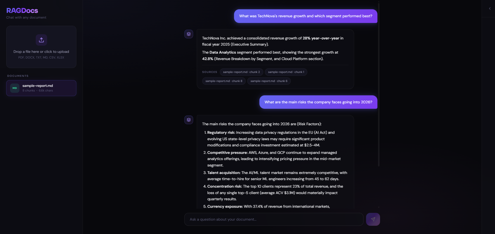
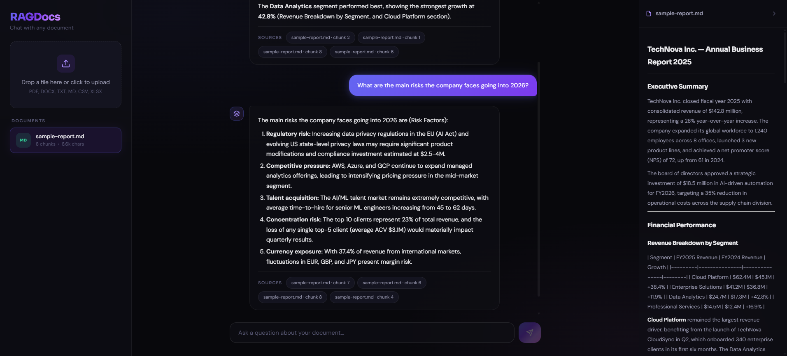
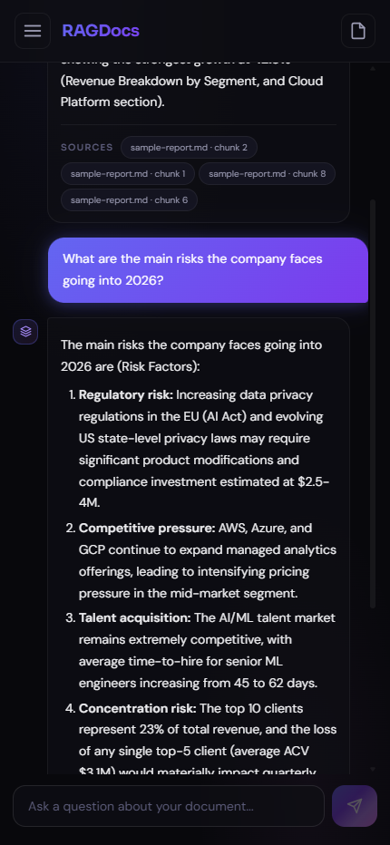

# RAGDocs

**Chat with any document using AI-powered Retrieval-Augmented Generation**

RAGDocs lets you upload PDF, DOCX, TXT, MD, CSV, and Excel files, then ask questions in natural language. The system extracts text, creates vector embeddings, and uses semantic search + LLM generation to provide accurate, cited answers grounded in your documents.


---

## Demo

> Upload a document, ask a question, get an answer with sources.

<p align="center">
  
</p>

<details>
<summary><strong>More screenshots</strong></summary>
<br>

| Upload & Chat | Document Preview | Mobile View |
|:---:|:---:|:---:|
|  |  |  |

</details>

---

## Features

- **6 file formats** Upload PDF, DOCX, TXT, Markdown, CSV, and Excel (.xlsx) files
- **Streaming responses** Answers appear token-by-token in real time via Server-Sent Events
- **Source citations** Every response shows exactly which document chunks were used
- **Document preview** Side panel renders document content with Markdown formatting and tabular data support
- **Conversation memory** Multi-turn chat with context from previous messages
- **Responsive UI** Glassmorphism dark theme with mobile drawer navigation, works on any screen size
- **Drag & drop upload** Drop files directly onto the sidebar to process them
- **One-command setup** `docker compose up --build` and you're running

---

## Architecture

```
                    ┌──────────────────────────────────────────────┐
┌──────────────┐    │  FastAPI Backend                             │
│              │    │                                              │
│  React 19    │───▶│  ┌─────────────┐     ┌───────────────────┐  │
│  + Vite 6    │    │  │  Document    │     │   RAG Engine       │  │
│              │◀───│  │  Processor   │────▶│                    │  │
│  Glassmorphism│    │  │             │     │  LangChain         │  │
│  Dark UI     │    │  │  PyMuPDF    │     │  Gemini Embeddings │  │
│              │    │  │  python-docx │     │  ChromaDB Store    │  │
└──────────────┘    │  │  openpyxl   │     │  Gemini 2.5 Flash  │  │
                    │  └─────────────┘     └───────────────────┘  │
                    └──────────────────────────────────────────────┘
```

**Data flow:**

1. **Upload** User drops a file onto the React frontend
2. **Extract** Backend extracts text using PyMuPDF (PDF), python-docx (DOCX), openpyxl (XLSX), or plain decode (TXT/MD/CSV)
3. **Chunk** Text is split into overlapping segments using LangChain's `RecursiveCharacterTextSplitter`
4. **Embed** Each chunk is vectorized with Google's `gemini-embedding-001` model
5. **Store** Vectors are persisted in ChromaDB for fast similarity search
6. **Query** User's question is embedded, top-k similar chunks are retrieved, and fed as context to Gemini 2.5 Flash
7. **Stream** LLM streams the answer token-by-token via SSE, with source citations

---

## Quick Start

### Prerequisites

- [Docker](https://docs.docker.com/get-docker/) and Docker Compose
- A [Google Gemini API key](https://aistudio.google.com/apikey) (free tier works)

### 1. Clone and configure

```bash
git clone https://github.com/JuanCardona97/ragdocs.git
cd ragdocs
cp .env.example .env
```

Edit `.env` and add your API key:

```env
GOOGLE_API_KEY=your-api-key-here
```

### 2. Run

```bash
docker compose up --build
```

### 3. Open

- **App:** [http://localhost:3000](http://localhost:3000)
- **API docs:** [http://localhost:8001/docs](http://localhost:8001/docs)

---

## Local Development

### Backend

```bash
cd backend
python -m venv .venv
source .venv/bin/activate  # Windows: .venv\Scripts\activate
pip install -r requirements.txt
uvicorn app.main:app --reload --port 8000
```

### Frontend

```bash
cd frontend
npm install
npm run dev
```

### Tests

```bash
cd backend
pytest -v
```

---

## API Reference

| Method | Endpoint | Description |
|--------|----------|-------------|
| `GET` | `/health` | Health check |
| `POST` | `/documents/upload` | Upload and process a document |
| `GET` | `/documents` | List all uploaded documents |
| `GET` | `/documents/{id}/preview` | Get extracted text for preview |
| `DELETE` | `/documents/{id}` | Delete a document and its embeddings |
| `POST` | `/chat` | Ask a question (single response) |
| `POST` | `/chat/stream` | Ask a question (streaming SSE) |

<details>
<summary><strong>Example: Chat request</strong></summary>

```bash
curl -X POST http://localhost:8001/chat \
  -H "Content-Type: application/json" \
  -d '{"question": "What are the main conclusions?", "document_id": "abc123"}'
```

**Response:**

```json
{
  "answer": "The report concludes that renewable energy adoption increased by 35% in 2024...",
  "sources": [
    {
      "content": "In conclusion, renewable energy sources saw a 35% increase...",
      "filename": "energy-report-2024.pdf",
      "chunk_index": 12
    }
  ]
}
```

</details>

---

## Configuration

All settings via environment variables (see `.env.example`):

| Variable | Default | Description |
|----------|---------|-------------|
| `GOOGLE_API_KEY` | — | Google Gemini API key **(required)** |
| `LLM_MODEL` | `gemini-2.5-flash` | LLM for answer generation |
| `EMBEDDING_MODEL` | `models/gemini-embedding-001` | Embedding model |
| `CHUNK_SIZE` | `1000` | Characters per text chunk |
| `CHUNK_OVERLAP` | `200` | Overlap between chunks |
| `TOP_K_RESULTS` | `4` | Chunks retrieved per query |
| `TEMPERATURE` | `0.1` | LLM temperature |

---

## Project Structure

```
ragdocs/
├── backend/
│   ├── app/
│   │   ├── main.py             # FastAPI routes & SSE streaming
│   │   ├── rag_engine.py       # RAG pipeline (ingest + query + stream)
│   │   ├── embeddings.py       # Text extraction & chunking
│   │   ├── models.py           # Pydantic schemas
│   │   └── config.py           # Environment-based settings
│   ├── tests/
│   │   ├── conftest.py         # Shared fixtures & mocks
│   │   ├── test_api.py         # API endpoint tests
│   │   └── test_embeddings.py  # Document processing tests
│   ├── requirements.txt
│   └── Dockerfile
├── frontend/
│   ├── src/
│   │   ├── App.jsx             # Main layout with responsive panels
│   │   ├── App.css             # Obsidian Prism theme & responsive styles
│   │   └── components/
│   │       ├── ChatWindow.jsx      # Chat with streaming & Markdown
│   │       ├── FileUpload.jsx      # Drag-and-drop upload
│   │       ├── DocumentList.jsx    # Document cards with file-type badges
│   │       └── DocumentPreview.jsx # Side panel with tabular/text rendering
│   ├── package.json
│   ├── vite.config.js
│   └── Dockerfile
├── docker-compose.yml
├── .env.example
└── README.md
```

---

## Tech Stack

| Layer | Technology | Purpose |
|-------|-----------|---------|
| **Backend** | FastAPI | Async API with auto-generated docs |
| **RAG Framework** | LangChain | Chains, retrievers, prompt templates |
| **Vector Store** | ChromaDB | Embedded vector DB, no server needed |
| **Embeddings** | Gemini `embedding-001` | High quality, free tier available |
| **LLM** | Gemini 2.5 Flash | Fast streaming, free tier available |
| **PDF Parsing** | PyMuPDF | Fastest Python PDF extraction |
| **DOCX Parsing** | python-docx | Microsoft Word support |
| **Excel Parsing** | openpyxl | XLSX and CSV support |
| **Frontend** | React 19 + Vite 6 | Modern DX with fast HMR |
| **Styling** | Custom CSS | Glassmorphism dark theme, fully responsive |
| **Containerization** | Docker Compose | One-command full-stack setup |

---

## Roadmap

- [ ] Authentication (Google/GitHub OAuth)
- [ ] Multi-user support with isolated document spaces
- [ ] Deploy to Railway/Render with one-click setup
- [ ] Support for open-source LLMs via Ollama
- [ ] Document annotations and highlights
- [ ] Export conversations as PDF/Markdown

---

## License

MIT License — see [LICENSE](LICENSE) for details.

---

## Contributing

Contributions welcome! Please open an issue first to discuss what you'd like to change.
